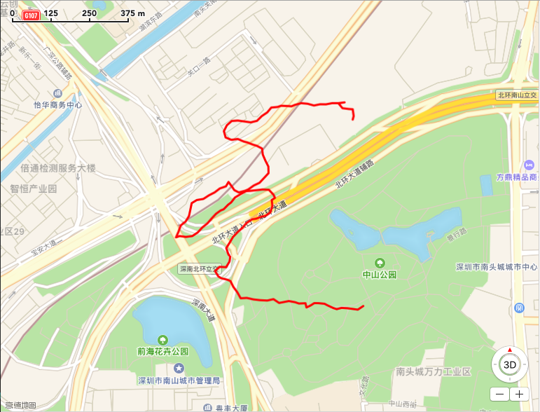
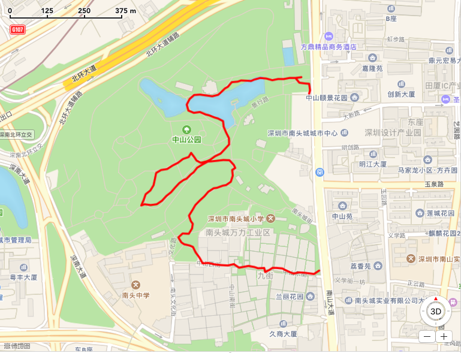

# GPX File in China

> GPX文件中国大陆偏移处理程序

## 1. 简介

中国大陆地区使用的坐标系为**WGS84**，而大部分GPS设备输出的坐标系为**GCJ02**，这就导致了设备导出GPX文件在大陆有一定的偏移现象，原来是想写GUI的，但是GUI不跨平台，我又懒得写，Swift又反人类，就写Python了。





## 2. 安装

环境：`Python 3.6+`

安装依赖

- 使用`pipenv`
    
    ```bash
    pipenv install
    ```
- 使用`pip`
    
    ```bash
    pip install -r requirements.txt 
    ```

## 3. 使用

```bash
python -f 001.gpx -t 001_china.gpx
```

会读取`001.gpx`，转换后写入`001_china.gpx`

## 4. 鸣谢

虽然在依赖里没有，但本程序使用了[scateu/PyWGS84ToGCJ02](https://github.com/scateu/PyWGS84ToGCJ02)的部分代码，感谢。

